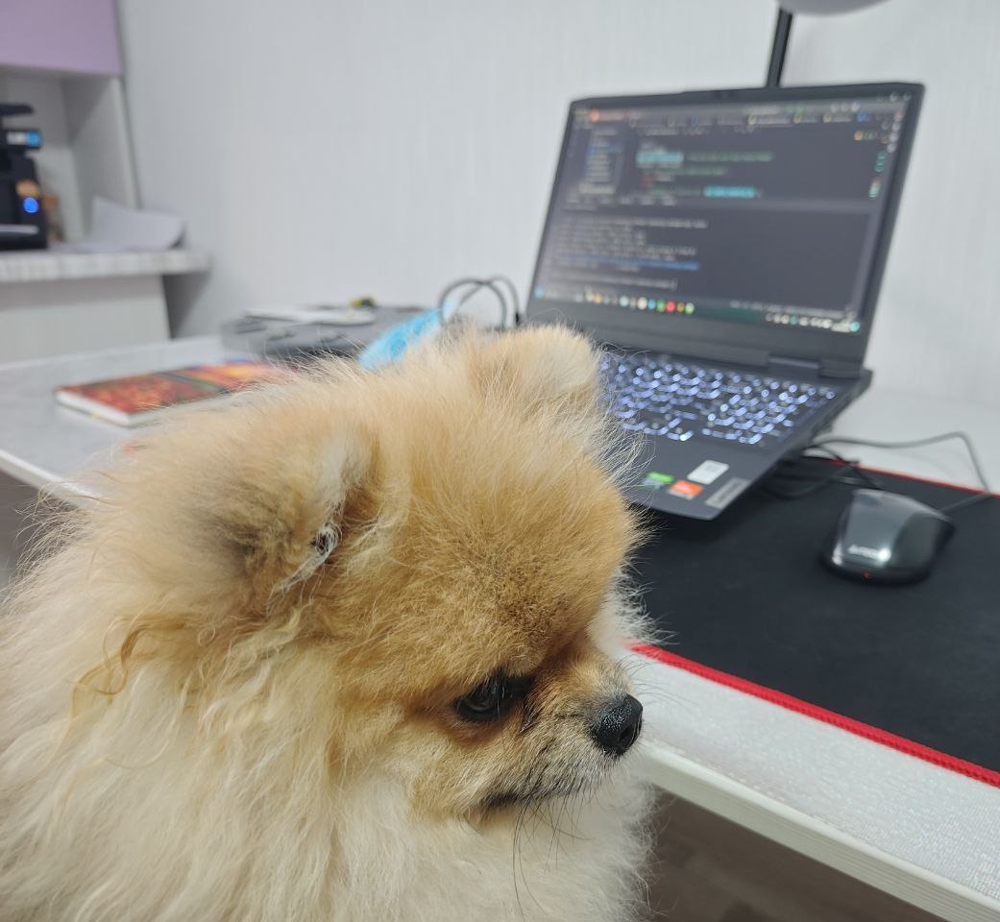
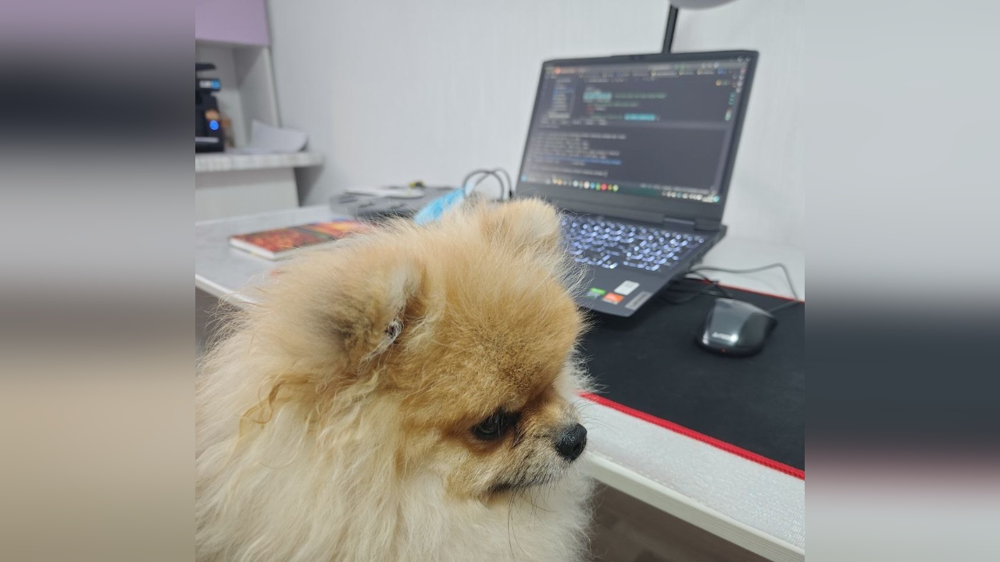

# Batch Image Processor with Background Blur (BBB)

---

[![License][license-badge]][license]
[![Issues][issues-badge]][issues]
[![GitHub last commit][last-commit-badge]]()

This Python script batch processes images by resizing them to a target resolution and applying a blurred background
effect. It supports various image formats and allows for optional format conversion. The output images are saved in a
specified destination folder.

## Features

- Resizes images to a given resolution while maintaining the aspect ratio.
- Applies a blurred background effect to fill the empty space around the resized image.
- Supports multiple common image formats.
- Optionally converts images to a specified format.
- Logs progress and errors using Python's `logging` module.

## Supported Formats

- `.bmp`, `.dib` (Windows bitmaps)
- `.jpeg`, `.jpg`, `.jpe` (JPEG)
- `.jp2` (JPEG 2000)
- `.png` (Portable Network Graphics)
- `.webp` (WebP)
- `.tiff`, `.tif` (TIFF)
- `.hdr`, `.pic` (Radiance HDR)

## Requirements

- Python 3.7+
- OpenCV (`cv2`)
- Numpy

You can install the required dependencies using `pip`:

```bash
pip install -r requirements.txt
```

## Usage

The script takes the source folder, destination folder, and several optional parameters such as the output format and
resolution.

### Basic Usage

```bash
python script.py <src_folder> <dst_folder>
```

- `<src_folder>`: The source folder containing the images to process.
- `<dst_folder>`: The destination folder to save the processed images.

### Optional Arguments

- `--format`: Convert images to a specific format (e.g., `.jpg`, `.png`).
- `--resolution`: Output resolution in the format `width height` (default is `1920 1080`).

### Example

Resize all images in the `input_images` folder to `1280x720` and save them as `.jpg` files in the `output_images`
folder:

```bash
python script.py input_images output_images --format .jpg --resolution 1280 720
```




## Contributing

Feel free to open an issue or submit a pull request if you encounter any problems or have suggestions for improvements.

## License

This project is licensed under the MIT License. See the `LICENSE` file for more details.

[code-quality-badge]: https://img.shields.io/scrutinizer/g/alexgoryushkin/BBB.svg

[code-quality]: https://scrutinizer-ci.com/g/alexgoryushkin/BBB/?branch=master "Code quality on Scrutinizer"

[license-badge]: https://img.shields.io/badge/License-MIT-brightgreen.svg

[license]: https://github.com/alexgoryushkin/BBB/blob/master/LICENSE "License"

[issues-badge]: https://img.shields.io/github/issues-raw/alexgoryushkin/BBB.svg?maxAge=25000

[issues]: https://github.com/alexgoryushkin/R/issues "Issues"

[last-commit-badge]: https://img.shields.io/github/last-commit/alexgoryushkin/BBB.svg?style=flat